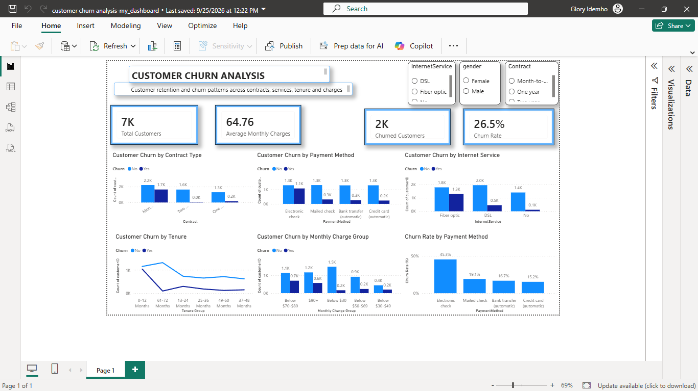

# Customer Churn Analysis

## 📊 Interactive Power BI Dashboard

An interactive customer churn analysis project developed using **Microsoft Power BI** to identify customer retention patterns and examine the factors associated with customer churn.

The dashboard provides an overview of customer churn across contract types, payment methods, internet services, tenure, and monthly charges.

## 🎯 Project Objective

The objective of this project is to analyze customer churn patterns and provide business insights that can support customer retention strategies.

The analysis focuses on:

- Customer churn rate
- Churned customer volume
- Contract type
- Payment method
- Internet service
- Customer tenure
- Monthly charge groups

## 🛠️ Tools Used

Microsoft Power BI – Data visualization and dashboard development
Power Query – Data transformation and preparation
DAX – Measures and KPI calculations
GitHub – Project documentation and portfolio hosting

## 📌 Key Performance Indicators

The dashboard provides four major KPIs:

KPI - Value 

Total Customers - 7K
Average Monthly Charges - 64.76
Churned Customers - 2K
Churn Rate - 26.5%

*Note: KPI values represent the overall dataset view. Selecting slicers dynamically changes the results.*

## 📈 Dashboard Analysis

The dashboard examines customer churn across:

1. Contract Type
Compares churn patterns across month-to-month, one-year, and two-year contracts.

2. Payment Method
Analyzes customer churn across electronic check, mailed check, bank transfer, and credit card payment methods.

3. Internet Service
Examines churn patterns among customers using DSL, fiber optic, and customers without internet service.

4. Customer Tenure
Shows how customer churn patterns vary across different tenure groups.

5. Monthly Charges
Groups customers according to their monthly charges and compares churn patterns across the groups.

6. Churn Rate by Payment Method
Shows the percentage of customers who churn within each payment method category.

## 🔎 Key Insights

The dashboard highlights several notable patterns:

- Month-to-month contracts account for a substantial share of customer churn.
- Customers using electronic checks show a noticeably higher churn rate than the other payment methods.
- Churn varies across internet service categories, with fiber optic customers showing a notable churn volume.
- Customer churn patterns change across different tenure groups.
- Monthly charge levels show differences in customer churn volume.
- Interactive slicers allow users to investigate churn patterns by **Internet Service, Gender, and Contract Type**.

## 🎛️ Interactive Features

The dashboard includes slicers for:

- Internet Service
- Gender
- Contract Type

These filters dynamically update the dashboard KPIs and visualizations, allowing users to explore specific customer segments.

## 📷 Dashboard Preview

## 💼 Business Value

Customer churn can affect recurring revenue and customer lifetime value.

This analysis can help businesses:

- Identify customer segments with higher churn exposure
- Understand relationships between customer characteristics and churn
- Develop targeted customer retention strategies
- Investigate payment and service-related churn patterns
- Support data-driven customer relationship decisions

## 🚀 Future Improvements

Potential extensions of this project include:

- Building a customer churn prediction model using Python
- Applying machine learning classification techniques
- Developing customer lifetime value analysis
- Creating automated reporting
- Adding more customer segmentation analysis

## 👤 Author

gidemho

Economics Graduate | Data Analyst | Finance & Business Analytics

## 📂 Project Status

Completed Power BI dashboard and exploratory customer churn analysis.
